<!--
 * @Author: jiaminghui
 * @Date: 2022-10-18 22:12:48
 * @LastEditTime: 2022-11-18 22:50:26
 * @LastEditors: jiaminghui
 * @FilePath: \mh-music-web-react\README.md
 * @Description: 
-->
# 仿网易云音乐web

## 项目依赖
- 项目基于React框架编写
- 本项目需要网易云API服务：https://github.com/Binaryify/NeteaseCloudMusicApi
- **主播电台和新碟上架**接口使用的版本是**v3.32.2**，其余接口使用的版本是**v2.23.0**，有些版本的API接口发生变化会导致项目运行失败

## 项目自动化部署（jenkins）
- 安装`OpenJDK 11`-java环境：https://zhuanlan.zhihu.com/p/393172181
- 安装jenkins环境：https://www.jianshu.com/p/37b0fce69520
- 配置Git管理
    - 安装git plugin插件
    - 云服务器生成git密钥-公钥私钥
    - 公钥在github设置，测试ssh是否通过
    - 私钥在jenkins项目中配置（Credentials设置采用SSH Username with private key），key就是服务器生成的私钥
    - 配置jenkins中全局工具配置中的Git部分，设置Name（Github用户名）和Path（服务器上git的位置）
- jenkins上安装Node插件
- 配置全局工具配置中的NodeJS安装，别名随便起，目录是服务器上node安装地址（到bin文件夹，同时避免安装在root下没有权限）
- 新建Item的配置中，不要勾选构建环境中的`Provide Node & npm bin/ folder to PATH`，否则会报关于node文件夹下没有可执行的
- 安装Publish Over SSH插件，并在系统配置中添加SSH Servers（注意需要设置密码）
- 在Item的配置中，配置构建后操作
**注意：react项目中，不能报eslint的警告，不然jenkins打包项目时会报错，会自动将warn转成成错误**

## 项目访问地址

- 基于华为云服务器的项目部署（访问网址：http://139.9.104.53:7878/#/discover/recommend）

- **注意：云服务器性能较低，访问过程中部分功能反应较慢，请耐心等待**

## 项目技术总结
- 🔗 查看跳转 👉<a href="https://github.com/MinghuiJia/mh-music-web-react/issues">Issues</a>

## 当前完成的项目功能

### 发现音乐——推荐页

- 轮播图

- 热门推荐

- 新碟上架

- 榜单

- 歌曲详情(相似歌单、相似歌曲)

- 播放栏

- 播放列表

### 发现音乐——排行榜

- 排行榜展示及不同类型排行榜切换
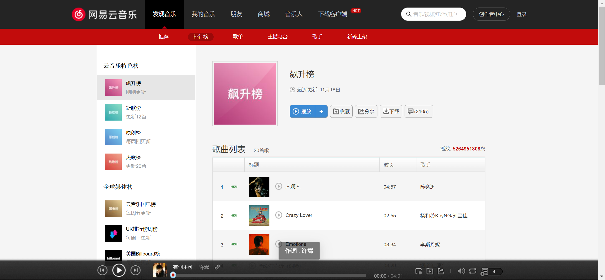
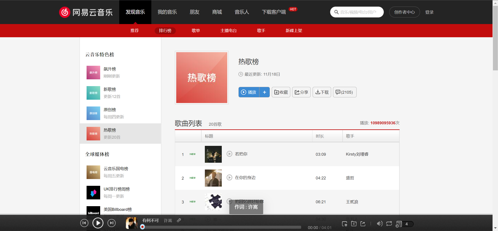

- 排行榜歌曲添加至播放列表并顺序播放

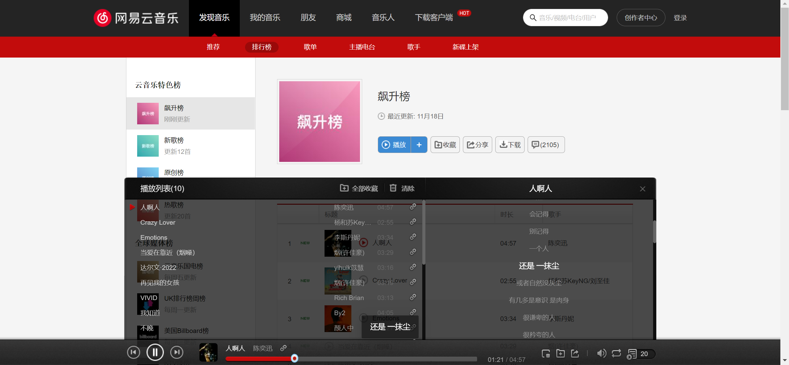

### 发现音乐——歌单

- 歌单展示
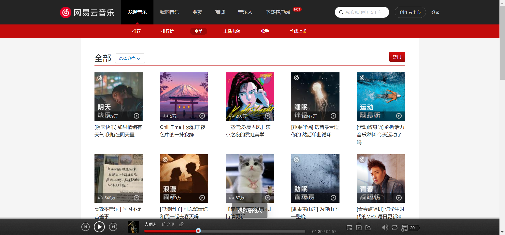

- 歌单类型切换
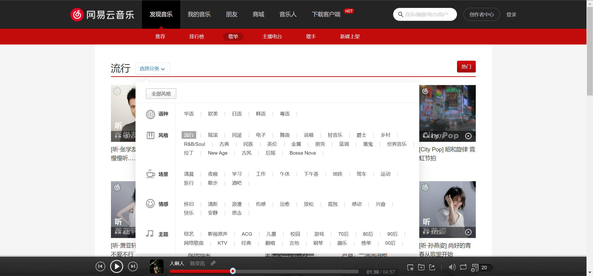

- 歌单分页
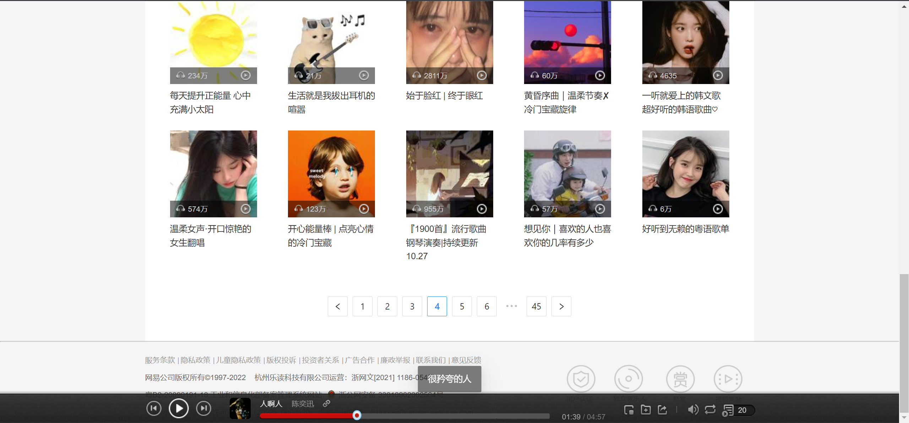

### 发现音乐——主播电台

- 电台展示
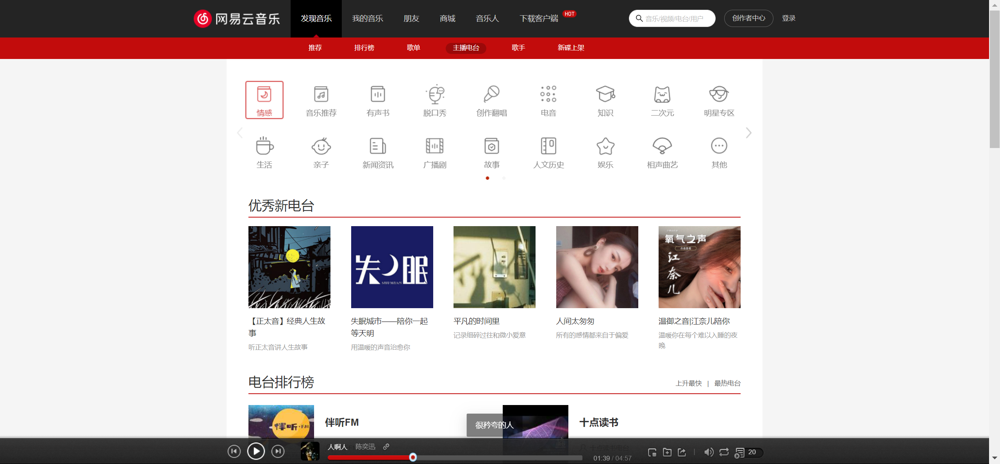

- 类型选择切换

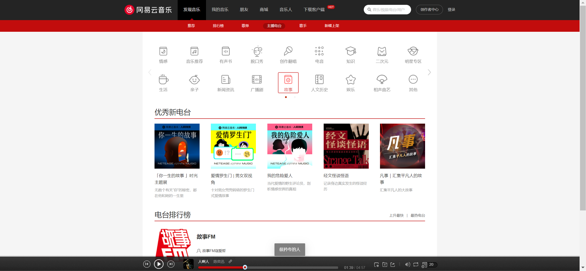

### 发现音乐——歌手

- 歌手展示即类型切换
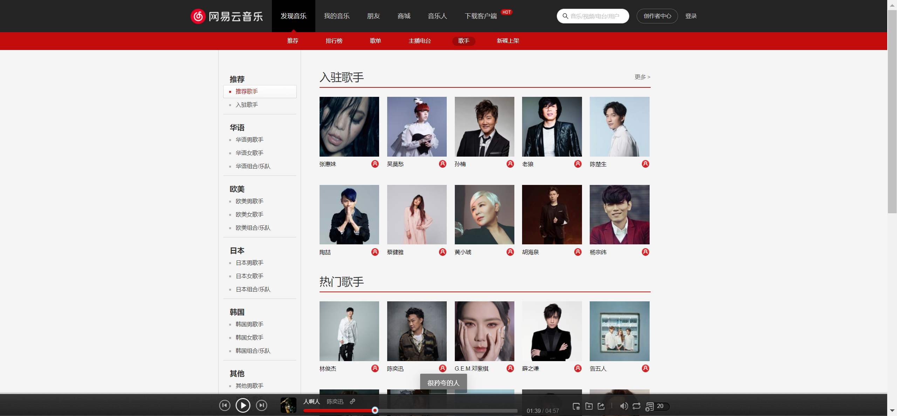
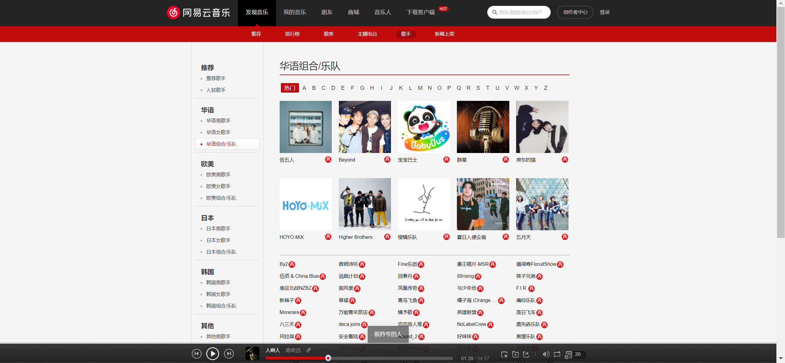

- 歌手名字排序
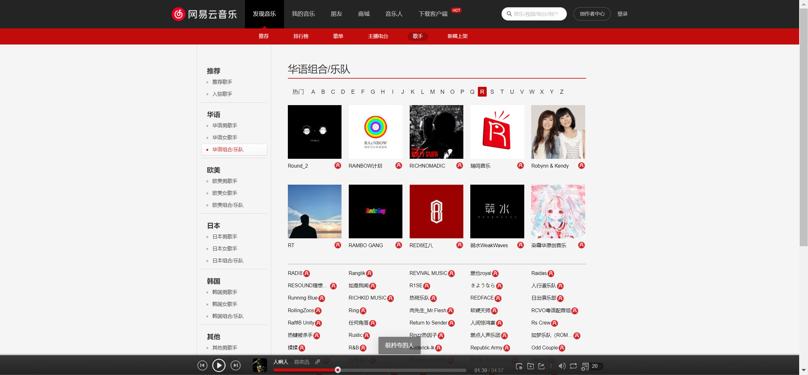

### 发现音乐——新碟上架

- 新碟展示即分页
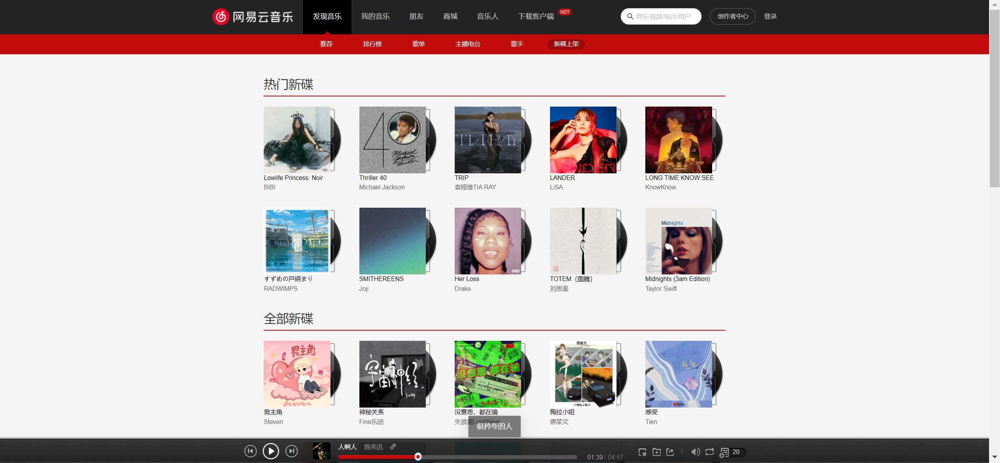
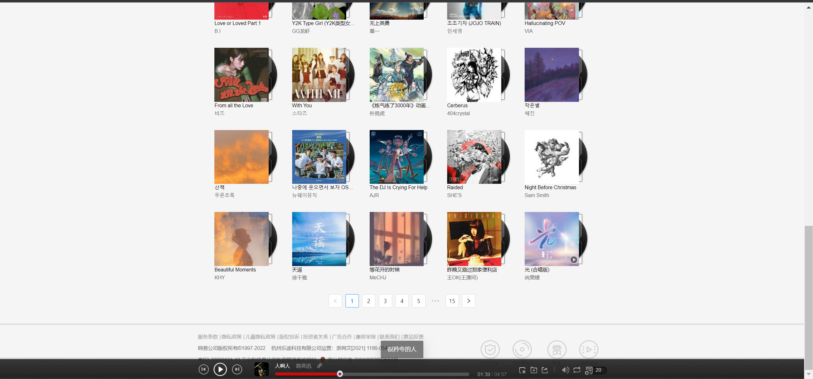
